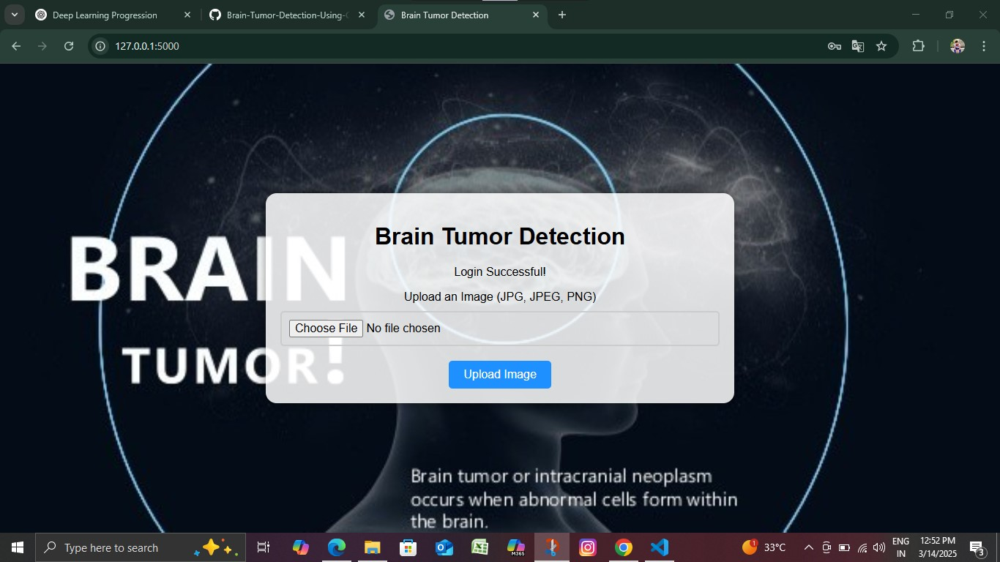
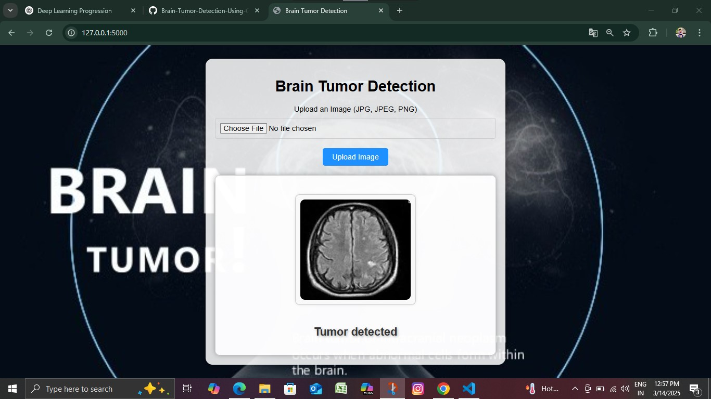

# Brain-Tumor-Detection-Using-CNN

This project is a **Brain Tumor Detection** system that analyzes MRI scan images to classify them as either **Tumor** or **No Tumor**. The goal is to assist medical professionals in identifying brain tumors using deep learning techniques.


## Features
- **MRI Image Input**: Takes MRI scan images as input for analysis.
- **Deep Learning Model**: Utilizes a Convolutional Neural Network (CNN) for classification.
- **Pretrained Model Support**: Can load a pretrained model for instant predictions.
- **Interactive Output**: Displays classification results with confidence scores.

## Getting Started

### Prerequisites
- Python 3.x
- Jupyter Notebook / Any Python IDE
- Libraries: `tensorflow`, `keras`, `numpy`, `opencv-python`, `matplotlib`

## Getting Started

### Installation
1. Clone the repository:
   ```bash
   git clone https://github.com/Tony-Ranjith/Brain-Tumor-Detection-Using-CNN.git
   ```
2. Navigate to the project directory:
   ```bash
   cd Brain-Tumor-Detection-Using-CNN
   ```
3. Install required libraries:
   ```bash
   pip install -r requirements.txt
   ```

### Dataset
The project uses an MRI scan dataset with labeled images:

- Tumor (Positive cases)
- No Tumor (Negative cases)
  
You can use publicly available datasets such as the Kaggle Brain Tumor Dataset

### Running the Project
1. Train The Model.(run the train.py Code).
   ```bash
   python train.py.py
   ```
4. Run the interactive interface to input MRI Image for Detection:
   ```bash
   python app.py
   ```
5. Upload The Image, and the model will display whether Brain tumor detected or Not.

## How It Works
### Image Preprocessing:

- Resizes images to 128x128 pixels.
- Converts to grayscale or normalizes RGB channels.
- Augments data to improve model performance.
### Model Architecture:

- Uses a Convolutional Neural Network (CNN) for feature extraction.
- Includes multiple Conv2D and MaxPooling layers.
- Ends with fully connected Dense layers for classification.
### Prediction:

 The trained model predicts whether an MRI scan contains a tumor or not.

## Future Improvements
- Improve accuracy using transfer learning with ResNet or EfficientNet.
- Deploy the model as a Flask web application for user-friendly interaction.
- Extend the dataset for better generalization.

## Screenshot of project
Home Page


Prediction


## Contributing
Feel free to submit issues or pull requests. All contributions are welcome!
